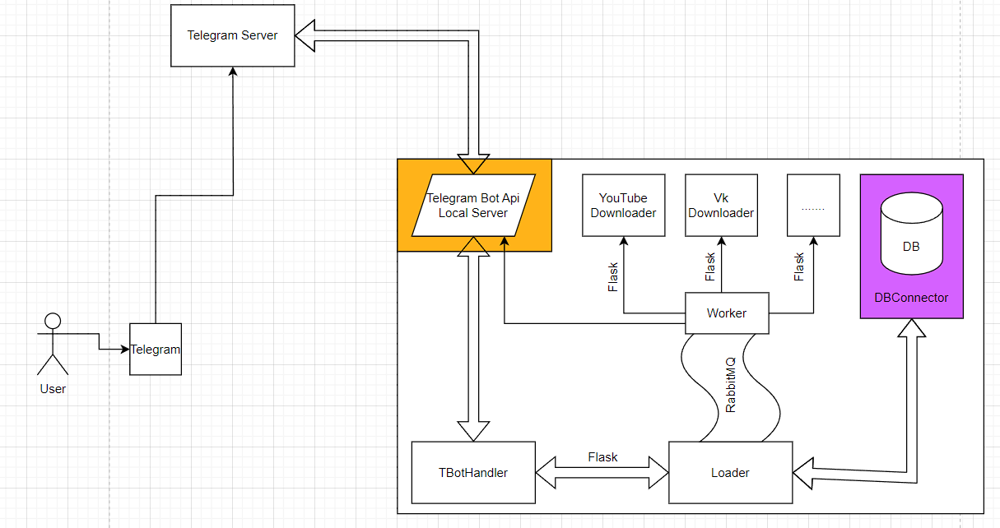

## Запуск

Для запуска необходимо заполнить файл [.env](.env.sample).

Получить `LOCAL_TELEGRAM_API_ID`, `LOCAL_TELEGRAM_API_HASH` можно на официальном
сайте [Telegram](https://my.telegram.org/).
Для получения `TELEGRAM_BOT_API_KEY` следует обратиться к [BotFather](https://t.me/BotFather).

> [!TIP]
> Рекомендуется заполнить все переменные окружения вида `*HOST` названием соответствующего сервиса
> в [docker-compose.yml](docker-compose.yml)


### Запуск на локальной машине

Если у Вас пока нет выделенного сервера с белым ip, то воспользуйтесь следующей инструкцией:

* Зарегистрируйтесь на сайте [ngrok](https://ngrok.com/) (для регистрации понадобится VPN, для использования - нет)
* Скачайте и запустите приложение ngrok
* В открывшейся командной строке выполните команду

  ```console
  ngrok http PORT
  ```
  `PORT` должен совпадать с `TELEGRAM_BOT_HANDLER_PORT`, не закрывайте окно командной строки до конца работы приложения
* Скопируйте полученный домен в `TELEGRAM_BOT_HANDLER_PROXY`
* Запустите [Docker](https://docs.docker.com/desktop/?_gl=1*1dcggd0*_ga*NDE4MTkyNTMwLjE2OTc0NDc1MTM.*_ga_XJWPQMJYHQ*MTcwOTA3NDkwNy4xNy4xLjE3MDkwNzQ5MDkuNTguMC4w) и выполнить команду

  ```console
  docker-compose up
  ```

### Запуск на сервере

> [!IMPORTANT]
> Сервер должен принимать **https** запросы
* Укажите в `TELEGRAM_BOT_HANDLER_PROXY` адрес сервера
* Запустите [Docker](https://docs.docker.com/desktop/?_gl=1*1dcggd0*_ga*NDE4MTkyNTMwLjE2OTc0NDc1MTM.*_ga_XJWPQMJYHQ*MTcwOTA3NDkwNy4xNy4xLjE3MDkwNzQ5MDkuNTguMC4w) и выполните команду

  ```console
  docker-compose up
  ```
  
## Архитектура приложения:



## Архитектура базы данных

Будет добавлена позже
