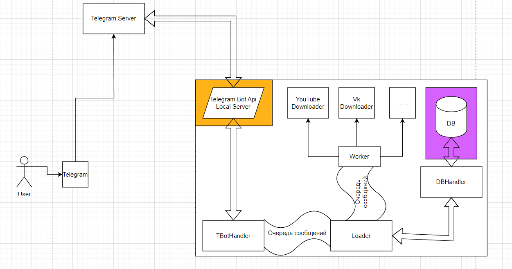

## Запуск

Для запуска необходимо заполнить .env, для получения api_id, api_hash сюда -> https://my.telegram.org/
Также их пока необходимо в ручную указать в src/py-bot-server/Dockerfile

Итак, шаги запуска(Пока нет выделенного сервера с выделенным ip) :

* Зарегистрирорваться на сайте [ngrok] (https://ngrok.com/) (для регистрации понадобится VPN, для использования - нет)
* Скачать и запустить приложение ngrok, в открывшейся командной строке выполнить: ngrok http номер_порта ( номер_порта должен
  совпадать с tbot_port, не закрывать до конца работы приложения)
* Запустить docker-compose (первый раз build > 15 минут) для разварачивания Telegram Bot Api Local Server
* Создать виртуальное окружение и запустить его
* Выполнить в командной строке pip install -r requirements.txt
* Запустить src/downloader/loader.py
* Запустить src/bot/bot_handler.py

## Примерная архитектура приложения:

    

## Примерная архитектура базы данных:
Будет добавлена позже
