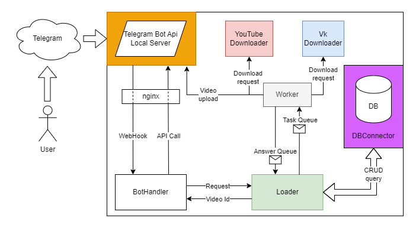

## Содержание

- [Содержание](#содержание)
- [Описание проекта](#описание-проекта)
- [Запуск приложения](#запуск-приложения)
    - [Запуск на локальной машине](#Запуск-на-локальной-машине)
    - [Запуск на сервере](#Запуск-на-сервере)
    - [Генерация автодокументации](#генерация-автодокументации)
- [Архитектура](#архитектура)
    - [Архитектура базы данных](#архитектура-базы-данных)
    - [Архитектура приложения](#архитектура-приложения)
    - [Паттерны проектирования](#паттерны-проектирования)

# Описание проекта

Наш проект представляет собой Telegram бота для скачивания видеозаписей с популярных видео хостингов. В его возможно
входит

- Загрузка видеозаписей по ссылке с платформы YouTube и VK Video
- Возможность подписываться на обновления плейлистов и автоматически получать добавленные видео

## Запуск приложения

Для запуска необходимо заполнить файл [.env](.env.sample).

Получить `LOCAL_TELEGRAM_API_ID`, `LOCAL_TELEGRAM_API_HASH` можно на официальном
сайте [Telegram](https://my.telegram.org/).
Для получения `TELEGRAM_BOT_API_KEY` следует обратиться к [BotFather](https://t.me/BotFather).

> [!TIP]
> Рекомендуется заполнить все переменные окружения вида `*HOST` названием соответствующего сервиса
> в [docker-compose.yml](docker-compose.yml)

### Запуск на локальной машине

Если у Вас пока нет выделенного сервера с белым ip, то воспользуйтесь следующей инструкцией:

* Зарегистрируйтесь на сайте [ngrok](https://ngrok.com/) (для регистрации понадобится VPN, для использования - нет)
* Скачайте и запустите приложение ngrok
* В открывшейся командной строке выполните команду

  ```console
  ngrok http PORT
  ```
  `PORT` должен совпадать с `TELEGRAM_BOT_HANDLER_PORT`, не закрывайте окно командной строки до конца работы приложения
* Скопируйте полученный домен в `TELEGRAM_BOT_HANDLER_PROXY`

* Запустите [Docker](https://docs.docker.com/desktop/?_gl=1*1dcggd0*_ga*NDE4MTkyNTMwLjE2OTc0NDc1MTM.*_ga_XJWPQMJYHQ*MTcwOTA3NDkwNy4xNy4xLjE3MDkwNzQ5MDkuNTguMC4w)
и выполнить команду

    ```console
    docker-compose up
    ```

### Запуск на сервере

> [!IMPORTANT]
> Сервер должен принимать **https** запросы

* Укажите в `TELEGRAM_BOT_HANDLER_PROXY` адрес сервера
* Настройте переадресацию запросов с главной страницы на `localhost:TELEGRAM_BOT_HANDLER_PORT`

* Запустите [Docker](https://docs.docker.com/desktop/?_gl=1*1dcggd0*_ga*NDE4MTkyNTMwLjE2OTc0NDc1MTM.*_ga_XJWPQMJYHQ*MTcwOTA3NDkwNy4xNy4xLjE3MDkwNzQ5MDkuNTguMC4w)
и выполните команду

    ```console
    docker-compose up
    ```

### Генерация автодокументации

Для автодокументирования кода используется библиотека [Sphinx](https://www.sphinx-doc.org/en/master/index.html).

> [!Warning]
> Инструкция написана для устройств семейства [ubuntu](https://ubuntu.com/)

Чтобы сгенерировать документацию, перейдите в корневую директорию проекта и выполните следующие команды:

```console
sudo apt install -y python3-dev
```

```console
python -m venv venv
```

```console
source venv/bin/activate
```

```console
sudo apt install -y build-essential libssl-dev libffi-dev
```

```console
pip install -r docs/requirements.txt
```

После выполнения этих команд, осталось запустить файл [documentation.sh](documentation.sh)

```console
sh documentation.sh
```

Теперь в папке **docs/build/html/** содержатся html-файлы документации

## Архитектура

Основной целью разработки архитектуры приложения было выстраивание
цепочки обработки запросов пользователя таким образом, чтобы гарантировать
способность приложения в любой момент времени ответить на сообщение клиента(responsibility).

### Архитектура базы данных


На приведенной картинке можно увидеть диаграмму связей между таблицами нашей базы данных.

Ключевыми являются таблицы **User**, **Video**, **Playlist**, *id* которых репрезентирует идентификатор
соответствующего типа данных в Telegram либо на видео хостинге.

Таблицы **User** и **Playlist**, а также **Video** и **Playlist** состоят в связи "многие-ко-многим"
через промежуточные таблицы.

База данных находится
в [третьей нормальной форме](https://learn.microsoft.com/ru-ru/office/troubleshoot/access/database-normalization-description#third-normal-form).

### Архитектура приложения



Обработка запроса происходит следующим образом:

1. Пользователь отправляет команду Telegram боту, запрос
   попадает [Telegram Bot Api Local Server](https://core.telegram.org/bots/api#using-a-local-bot-api-server) (далее
   просто локальный сервер)
2. Локальный сервер отправляет *https* запрос на адрес `TELEGRAM_BOT_HANDLER_PROXY`
3. По этому адресу расположен nginx, которые перенаправляет запрос на нужный порт (`TELEGRAM_BOT_HANDLER_PORT`)
4. **BotHandler** обрабатывает запрос и обращается к **Loader**(если требуется загрузить видео или плейлист)
5. **Loader** проверяет наличие запрашиваемого видео в базе данных и создаёт задание на его загрузку или на обновление
   данных о плейлисте.
   Он добавляет задачу в очередь сообщений и возвращает ответ **BotHandler**-у
6. **Worker** принимает задачу и выбирает загрузчик в зависимости от переданной ссылки
7. Загрузчик скачивает видео в общий volume или получает информацию о плейлисте и возвращает путь к файлу либо список из
   всех видеозаписей
8. **Worker** загружает полученное видео на локальный сервер и возвращает *file_id* - уникальный идентификатор для
   Telegram,
   либо возвращает список всех видеозаписей, полученный от загрузчика. Результат отправляется через очередь ответных
   сообщений
9. **Loader** обновляет базу данных в соответствии с полученным сообщением и передаёт *file_id* **BotHandler**-у
10. Используя *file_id* **BotHandler** пересылает уже загруженное видео пользователю

Также в фоновом режиме **Loader** каждые 10 минут обновляет данные в плейлистах.

Таким образом модуль, взаимодействующий с пользователем(BotHandler) отделяется от бизнес-логики по загрузке видео.

### Паттерны проектирования

Для достижения лучшей отзывчивости приложения используются два архитектурных паттерна:
* [Микросервисная архитектура.](https://cloud.yandex.ru/ru/blog/posts/2022/03/microservice-architecture) Позволяет разделить
приложение на слабо зависимые модули, общение между которыми происходит через API
* [Брокер сообщений.](https://www.enterpriseintegrationpatterns.com/patterns/messaging/MessageBroker.html) Чтобы отделить логику
работы с пользователем от бизнес-логики возможно использовать асинхронный обмен сообщениями, гарантирующий отказоустойчивость приложения
